### AI & Data Science Student 

Building projects. Solving problems. 

 

 

<h3 align="center">⚡ Currently</h3>

`DSA` • `C++` • `Python` • `AI` • `ML` • `Data Science`

 

|                 |                                                     |
| :-------------: | :-------------------------------------------------: |
|    🧩 **DSA**   | Improving problem solving & competitive programming |
|  🐍 **Python**  |         Building projects & exploring AI/ML         |
|  🤖 **AI / ML** |   Learning fundamentals and practical applications  |
|   📊 **Data**   |      Exploring analytics & data-driven projects     |
| 🚀 **Projects** |         Turning ideas into working software         |

<h3 align="center">🚀 Featured Projects</h3>

 

React • FastAPI • PostgreSQL • Python • Data Analytics

  

 

Python • Ursina • Physics • Procedural Generation

  

 

Python • GitHub API • Data Analysis

<h3 align="center">🛠️ Tech Stack</h3>

 

`Python` `C++` `JavaScript` `React` `FastAPI` `PostgreSQL` 

<h3 align="center">🧠 Problem Solving</h3>

Currently strengthening DSA, algorithms and competitive programming.

<h3 align="center">📫 Connect</h3>

])

 

 

<i>Building today what I couldn't build yesterday.</i>

